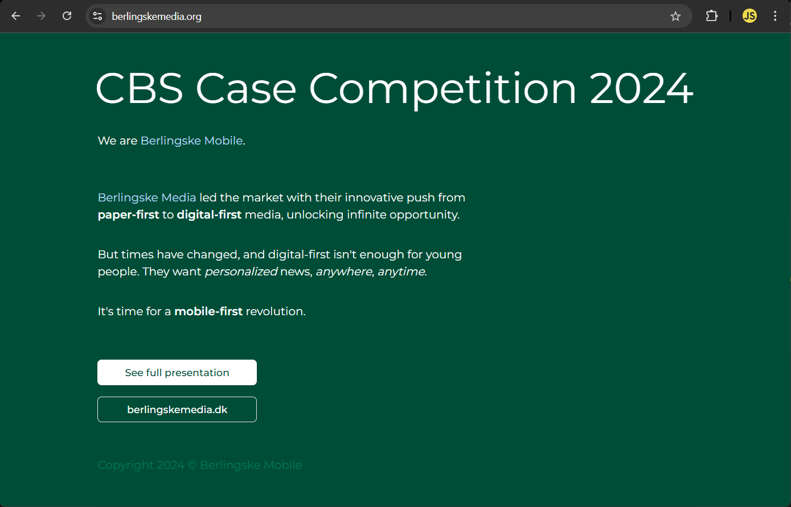
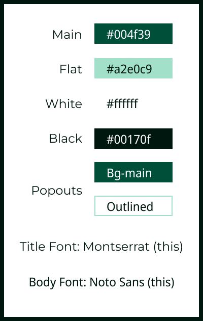

# CBS Global Case Competition 2024

The [CBS Global Case Competition 2024](https://www.casecompetition.com/global/) was on [Berlingske Media](https://www.berlingskemedia.dk), a Copenhagen-based news company in dire need of innovation.

I decided to put our team manifesto page up on a mimic domain, **[berlingskemedia.org](https://www.berlingskemedia.org)**.

### Project Conclusion

Despite not making it into the top 20 out of 336 projects, my team and I had a sweet experience and learned a lot, not only about the landscape of modern news innovation, but about each other's cultures and ways of approaching these types of problems.

Big thanks to my team members for this awesome 24-hour experience! So cool to come together in Denmark from around the world:

- [Thien](https://www.linkedin.com/in/thienzhi/) from Malaysia
- [Ben](https://www.linkedin.com/in/benjaminmedina/) from Chile
- [Srishti](https://www.linkedin.com/in/srishti-k-badaya/) from India
- [Josiah](https://www.linkedin.com/in/josiahplett/) from Canada

### Site Preview

In case I don't renew the [berlingskemedia.org](https://www.berlingskemedia.org) domain (or [our .com domain](https://www.berlinskemedia.com)), below is a screenshot of what our landing page looked like.

Note: Due to anonymization restrictions, our informal team name _Berlingske Mobile_ is the only identifier on the site.

### Report Submission

You can find our team's official submission [here](public/static/berlingske-mobile.pdf), or if the website is still live, [here](https://www.berlingskemedia.org/static/berlingske-mobile.pdf).

### Project Tech

- **Framework:** [Next.js](https://nextjs.org/)
- **Hosting:** [Vercel](https://vercel.com)
- **Styling:** [shadcn/ui](https://ui.shadcn.com/) with [Tailwind CSS](https://tailwindcss.com)
- **Presentation:** [Canva](https://www.canva.com/), [Figma](https://www.figma.com/), and Powerpoint

---

<a href="https://www.berlingskemedia.dk">Berlingske Media</a> theme styles we used for the site and presentation.

 

